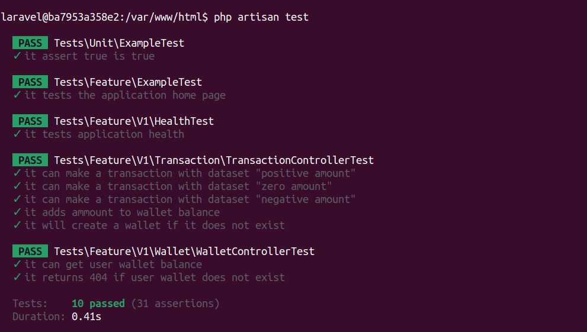
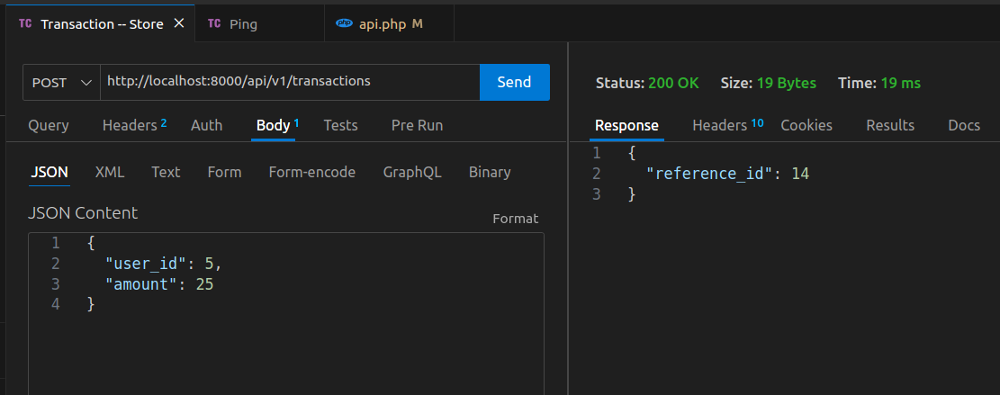
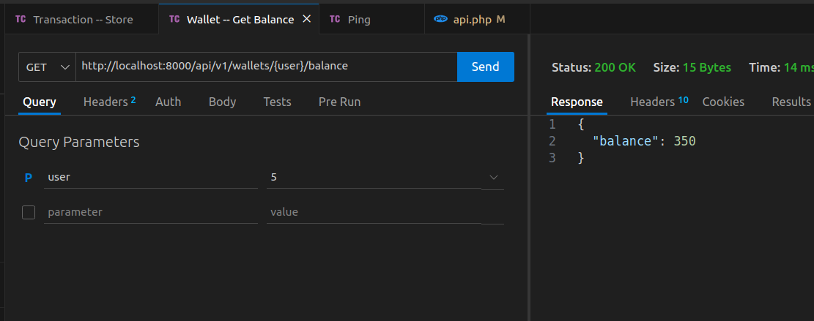

# User Wallet Service

A service designed to record and present user wallet data.

💡 [Github](https://github.com/mahdi375/WalletService)

## 🐋 `Setup`
### Clone the project

```bash
git clone git@github.com:mahdi375/WalletService.git
```

### Copy env
```bash
cp ./.env.example .env
```

### Modify env file if desired 
---
### Set up docker containers:
```bash
docker compose up -d --build
```
> 💡 `It takes about 30 seconds to bring all containers up and make them available due to health checking, following the building of Docker images.`

---

## 🚀 `Screenshots`:
- Tests

- Make Transaction

- Fetch User Wallet Balance
